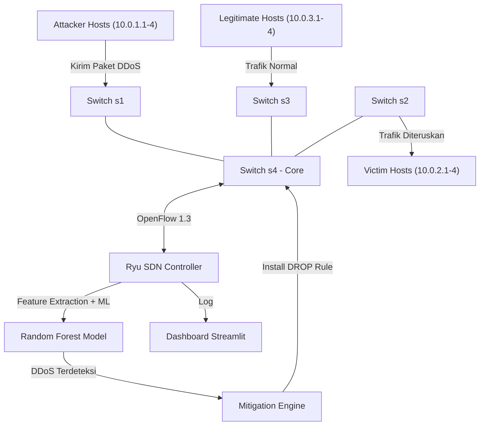
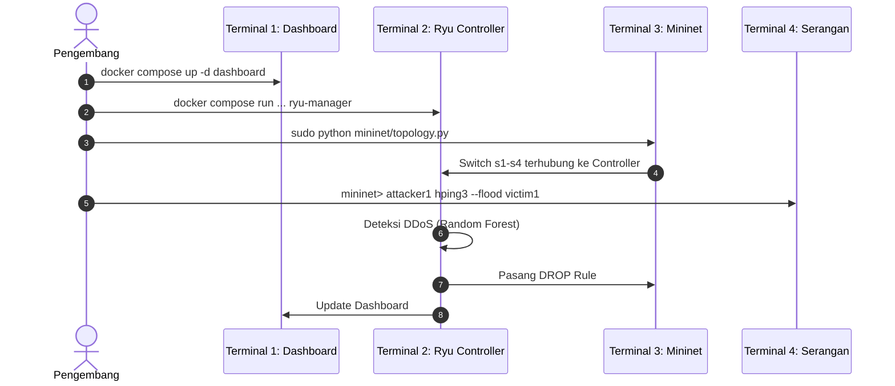

# 🛡️ Panduan Menjalankan LUCID-DDoS: Uji Jaringan SDN Penuh (Ryu + Mininet/Switch)

Dokumen ini adalah panduan lengkap untuk melakukan pengujian dan simulasi sistem deteksi serta mitigasi serangan DDoS berbasis **Random Forest (LUCID-RF)** pada arsitektur **Software-Defined Network (SDN)** menggunakan **Ryu Controller** dan **Mininet**.

---

## 🏗️ Arsitektur Sistem SDN



---

## 1. Persiapan Lingkungan

### A. Instal Mininet & Open vSwitch (WSL2)
```bash
sudo apt update
sudo apt install -y mininet openvswitch-switch openvswitch-common hping3
```

### B. Build Docker Container
```bash
docker compose build
```

---

## 2. Langkah Urutan Menjalankan (4 Terminal WSL2)



### 💻 Terminal 1 — Dashboard Streamlit
```bash
docker compose up -d dashboard
```
Buka **http://localhost:8501**, matikan *"Use Demo Data"*, aktifkan *"Auto Refresh"*.

### 💻 Terminal 2 — Ryu SDN Controller
```bash
docker compose run --rm -p 6633:6633 -p 6653:6653 controller ryu-manager controller/ryu_ddos_detector.py
```
*Biarkan terminal ini menyala — akan muncul log ketika switch terhubung.*

### 💻 Terminal 3 — Topologi Mininet
```bash
sudo python mininet/topology.py
```
Script ini otomatis:
1. Memastikan OVS daemon berjalan (fix untuk WSL2)
2. Membersihkan sisa Mininet sebelumnya
3. Membuat topologi (4 switch, 12 host)
4. Menjalankan `pingAll` untuk verifikasi konektivitas

Setelah berhasil, prompt `mininet>` akan aktif.

> [!NOTE]
> **Alamat IP Host:**
> | Role | Hosts | IP Range |
> |------|-------|----------|
> | Attackers | attacker1-4 | `10.0.1.1 - 10.0.1.4` |
> | Victims | victim1-4 | `10.0.2.1 - 10.0.2.4` |
> | Legitimate | legit1-4 | `10.0.3.1 - 10.0.3.4` |
>
> Semua host menggunakan subnet `/16` agar berada di broadcast domain yang sama (L2 reachable).

---

## 3. Meluncurkan Serangan (dari Mininet CLI)

### 🔥 ICMP Flood
```bash
mininet> attacker1 bash attack/icmp_flood.sh 10.0.2.1
```

### 🔥 TCP SYN Flood
```bash
mininet> attacker1 hping3 -S --flood -V -p 80 --rand-source 10.0.2.1
```

### 🔥 UDP Flood
```bash
mininet> attacker1 bash attack/udp_flood.sh 10.0.2.1
```

---

## 4. Verifikasi Deteksi & Mitigasi

### Di Terminal 2 (Ryu Controller)
Setiap 10 detik, Ryu mengumpulkan flow stats → ekstrak fitur → prediksi ML:
```text
WARNING: DDoS DETECTED! Attacker: 10.0.1.1, Confidence: 0.9850
INFO: Mitigation: DROP_RULE_INSTALLED(ip=10.0.1.1, priority=100, timeout=300s) (took 1.25ms)
```

### Di Dashboard Streamlit (Browser)
Grafik volume trafik melonjak, status berubah menjadi **CRITICAL**, IP penyerang masuk daftar **Blocked IPs**.

### Di Mininet CLI — Verifikasi Blokir
```bash
# Penyerang yang terblokir → 100% packet loss
mininet> attacker1 ping -c 3 victim1

# Host legitimate → 0% packet loss (tetap bisa berkomunikasi)
mininet> legit1 ping -c 3 victim1
```

---

## 📂 Log Aktivitas Serangan
File log: `logs/attack_log.csv`
Berisi: *Timestamp, Source IP, Destination IP, Prediksi, Confidence, Waktu Deteksi (ms), Waktu Mitigasi (ms), Aksi*.
